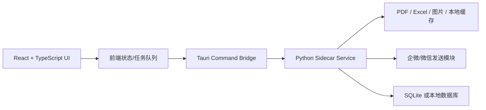

# 采购工作台迁移方案

## 结论

后续更适合走 `React + TypeScript + Tauri + Python sidecar`。PySide 能继续维护内部小工具，但当目标变成 Figma 风格的 B 端 CRM 软件时，前端生态、组件体系、设计稿还原和长期扩展都会更吃力。

## 为什么不继续只用 PySide

- CRM 页面会越来越多：订单、合同、供应商、发送、水单、报表、设置都需要一致的表格、筛选、抽屉、弹窗和状态管理。
- Figma 到前端的设计语言更容易在 Web 技术栈里落地，设计 token、组件状态、响应式布局都能复用。
- 桌面交付仍然可以保留，Tauri 打包后的体积通常比 Electron 更轻，也方便调用本机 Python 能力。
- Python 的优势应放在业务处理层：PDF/Excel/OCR/自动化发送，而不是承担复杂界面层。

## 目标架构



## 阶段计划

### V0 静态可视化原型

当前目录已经完成这一阶段：

- 首屏工作台信息架构
- CRM 风格视觉方向
- 核心交互模拟
- 后续接口边界草案

### V1 React 组件化

建议目录：

```text
src/
  app/
  components/
  modules/
    dashboard/
    orders/
    contracts/
    suppliers/
    messages/
    watermark/
  services/
  styles/
```

优先拆：

- `AppShell`：侧边栏、顶栏、模块导航
- `MetricCard`：关键指标
- `WorkflowBoard`：流程看板
- `DataTable`：业务表格
- `DetailDrawer`：右侧详情
- `FileDropzone`：文件拖拽入口

### V2 桌面壳与 Python 服务

桌面层建议使用 Tauri：

- 前端负责界面和交互。
- Tauri command 负责安全地调本机能力。
- Python sidecar 负责复用现有 PDF、Excel、企微发送、水单识别逻辑。

Python 服务建议先做成本地 HTTP 或 stdio RPC，再按需要收敛到 Tauri sidecar。

### V3 数据与权限

这一阶段再做：

- SQLite 本地数据库
- 操作审计日志
- 角色权限
- 自动更新
- 失败重试与任务队列
- 供应商、合同、订单统一编号规则

## 设计系统方向

- 主色：稳定蓝，用于导航选中、主按钮、聚焦边框。
- 辅助色：绿色表示完成，橙色表示待确认，红色表示异常。
- 圆角：B 端保持 8px 以内。
- 页面密度：偏紧凑，适合反复使用和扫描。
- 组件：表格、筛选、抽屉、弹窗、上传区、状态标签优先统一。
- 字体：中文优先使用 `Microsoft YaHei UI` 或后续统一为设计稿指定字体；浅色文字不得低于可读对比度。

## 迁移优先级

1. 先迁工作台外壳和导航。
2. 再迁采购订单和合同中心，因为这两个模块最能沉淀表格、筛选、详情抽屉。
3. 然后接入群聊发送和水单识别。
4. 最后补报表、权限、设置和自动更新。
